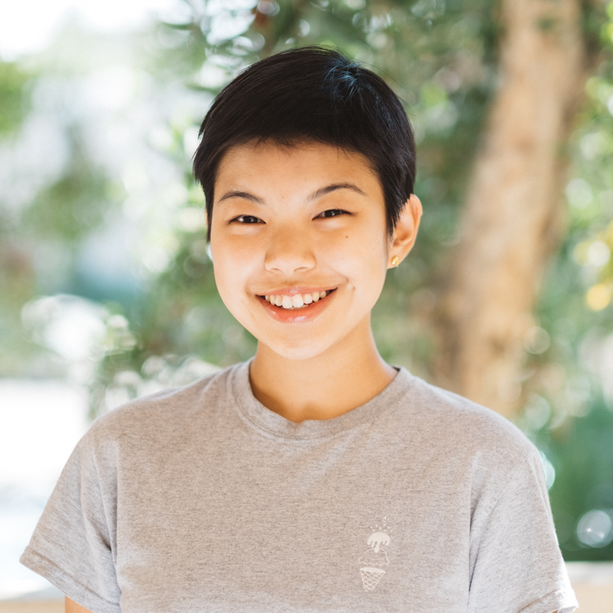

## About Me

Hi! I'm Myra, a first-year PhD student in Computer Science at Stanford. In Autumn 2022, I'm rotating with <a href="https://web.stanford.edu/~jurafsky">Dan Jurafsky</a>. My work is supported by the Knight-Hennessy Scholarship, Stanford EDGE Fellowship, and NSF GRFP.

I double-majored in computer science and <a href="https://thesis.library.caltech.edu/14990/">history</a> at Caltech, where I was advised by Professors <a href="http://www.yisongyue.com/">Yisong Yue</a>, Joel Burdick, and Maura Dykstra.
 
My email is myra1 [at] stanford [dot] edu. 

<!-- 

 -->

