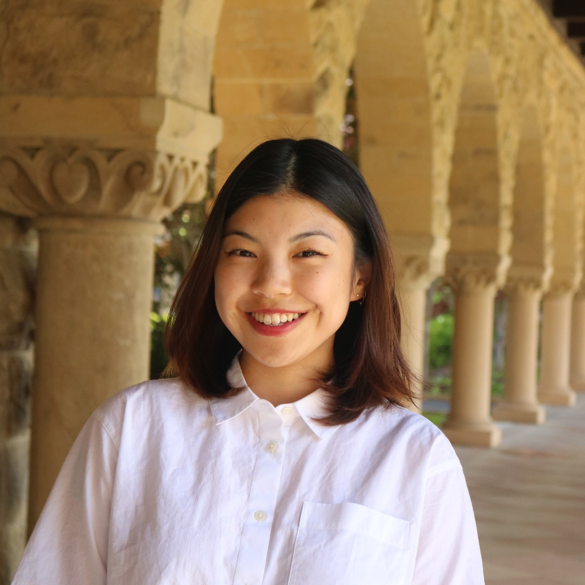

I am a final-year PhD candidate in Computer Science in the Stanford NLP group. My research interest is in building language technologies that promote human agency and wellbeing. Drawing on insights from linguistics and psychology, I develop computational methods for understanding and improving how people use LLMs, especially in subjective, high-stakes domains.
I am advised by <a href="https://web.stanford.edu/~jurafsky">Dan Jurafsky</a> and supported by the Knight-Hennessy Scholarship and the NSF Graduate Research Fellowship. 

### Contact
My email is myra [at] cs [dot] stanford [dot] edu.

### Updates
**July 2026**: Presenting papers on [understanding LLM safety failures using pragmatics](https://aclanthology.org/2026.acl-long.736/), [challenging anthropomorphic assumptions](https://aclanthology.org/2026.acl-long.118/) (orals), and [broadening LLM research to non-adopters' needs](https://aclanthology.org/2026.findings-acl.67/) (poster) at ACL!   

**June 2026**: In Seattle visiting [Yulia Tsvetkov's group](https://tsvetshop.github.io/) at UW for the summer!

**March 2026**: Our work on [AI sycophancy](https://www.science.org/doi/10.1126/science.aec8352) is the _Science_ cover story!

**June 2025**: Our paper on how [computer vision powers surveillance](https://www.nature.com/articles/s41586-025-08972-6) is out in _Nature_!

**May 2025**: Our work on [social sycophancy](https://arxiv.org/pdf/2505.13995) is featured in [MIT Technology Review](https://www.technologyreview.com/2025/05/30/1117551/this-benchmark-used-reddits-aita-to-test-how-much-ai-models-suck-up-to-us/)! 

**May 2025**: Two papers on [measuring](https://www.arxiv.org/pdf/2502.13259) and [mitigating](https://arxiv.org/pdf/2502.14019) anthropomorphic LLM outputs accepted to ACL 2025.

**April 2025**: Our paper on [Using metaphors to understand public perceptions of AI](https://www.arxiv.org/pdf/2501.18045) accepted to FAccT 2025.

**October 2024**: Attending [AIES](https://www.aies-conference.com/2024/). 

**October 2024**: ["I Am the One and Only, Your Cyber BFF": Understanding the Impact of GenAI Requires Understanding the Impact of Anthropomorphic AI](https://arxiv.org/abs/2410.08526).  
